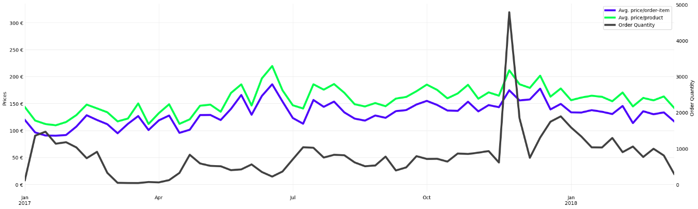

# Eniac Data Analysis Project

## Project overview

This project was part of a Data Science Bootcamp at WBS Coding School. 
Base of the project was a collection of data (e.g. orderlines, products, brands) from a real but anonymized company. To make things simpler, it shall be called *Eniac* from now on. 
The project was structured in the following way:
1. **Data preparation and cleaning** 
   The provided data had a lot of inconsistencies, sometimes missing information etc. So the first part of the project was to provide a consistent and reliable dataset. 
    
2. **Data analysis** 
   The now reliable dataset was analysed regarding customerbehaviour. Goal was to find out if and how strongly discounts on product prices boost revenue and/or sales. 
    
   - **Cluster products** 
     Products were clustered using a product-type attribute already present in the data. 
     Further clustering was done using Google Gemini AI controlled via Python code. 
      
   - **Discounts, revenues and sales over time** 
     Product-clusters were analyzed over time to get an overview and find out general patterns. 
   - **Find correlations between discounts and revenue/sales** 
     Linear-regression models between discounts and revenue/sales were setup per product-type. 
      
4. **Present results** 
   Results of the data analysis were ordered by importance and impact on the company. Finally results were presented using Google Slides. 
    
    

## Project presentation

The following shows some images from the final presentation. 
See the full presentation over on <a href="https://docs.google.com/presentation/d/1MgT4-HUO19ZwohObSgC9Dpi1rOVWpC7COi-TduYRChg/edit?usp=sharing">[Google Slides]</a>.

 
 
 
 
 
 
 
 
 

## Data analysis

 
 

 
 

 
 
