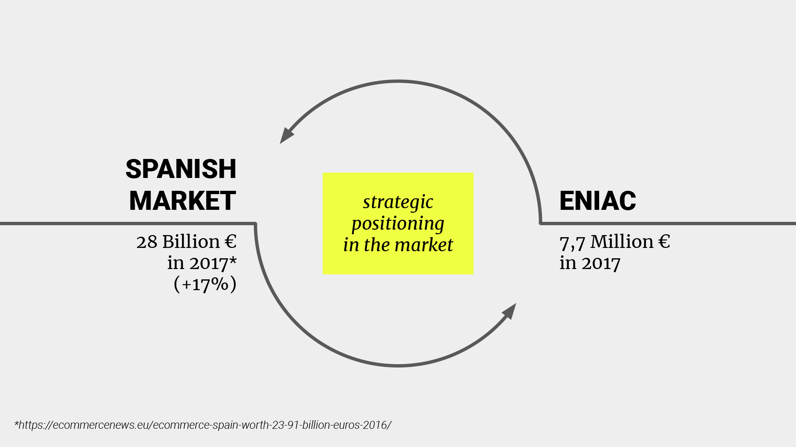
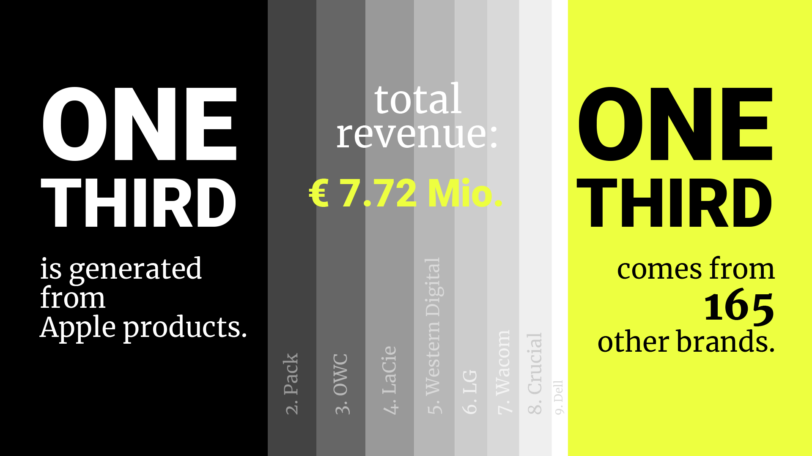
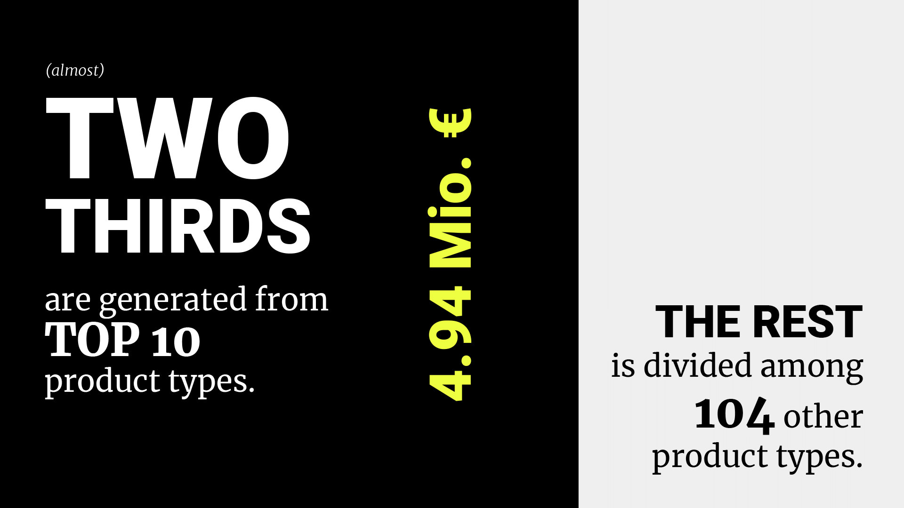
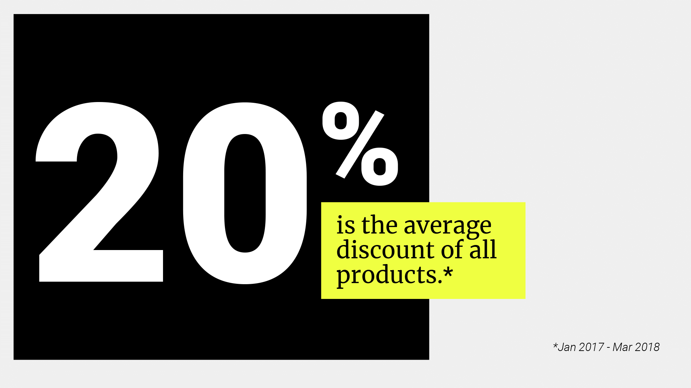
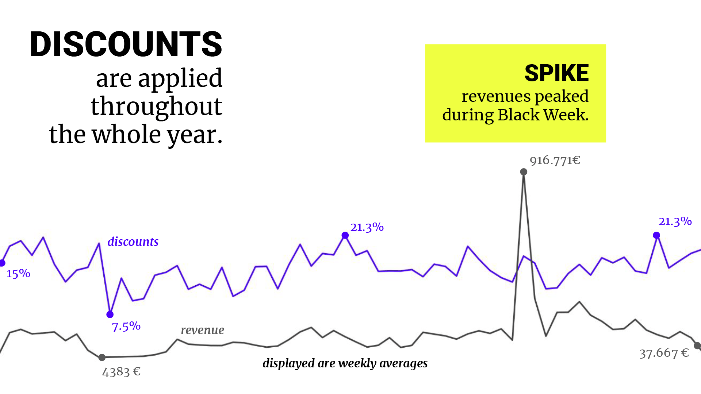
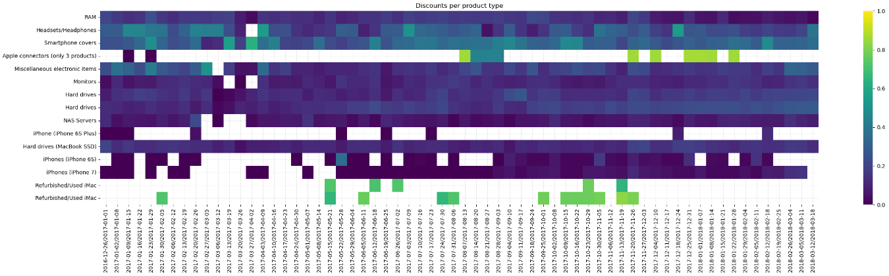
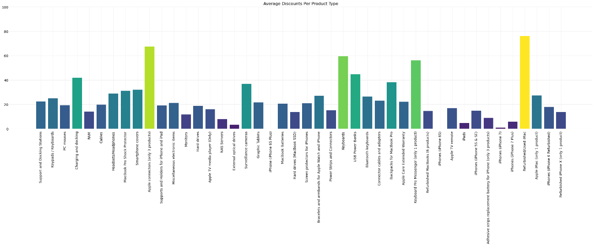

# Eniac Data Analysis Project

## Project overview

## Project presentation

The following shows some images from the final presentation. 
See the full presentation over on <a href="https://docs.google.com/presentation/d/1MgT4-HUO19ZwohObSgC9Dpi1rOVWpC7COi-TduYRChg/edit?usp=sharing">[Google Slides]</a>.

 
 
 
 
 
 
 

## Data analysis

 
 

 
 

